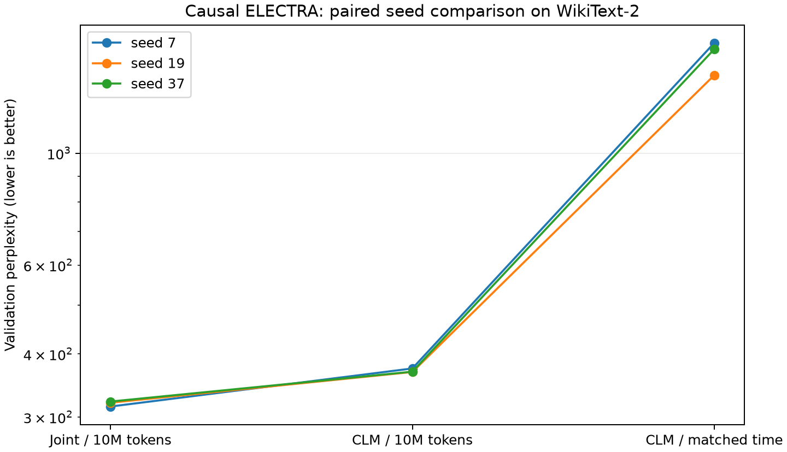
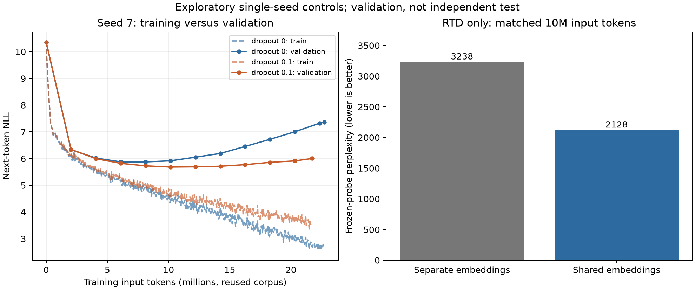

# Causal ELECTRA follow-up research

## Predeclared design: 2026-10-01

The matrix checks whether the first seed's joint PPL improvement repeats, and
whether extra training time explains it. Seeds 7, 19, and 37 and the following
conditions were fixed before observing the matrix results.

| Condition | Input-token cap | Training-time limit |
| --- | --- | --- |
| Joint | 10M | None |
| CLM | 10M | None |
| CLM time control | 30M | Measured joint training time from the same seed |

Training repeatedly samples the same approximately 1M-token WikiText-2 subset.
The 10M/30M budgets are input tokens, not unique data. Main initialization, batch
RNG, and optimizer settings match within each seed. Learning rate is fixed at
0.0003 with no learning-rate warmup or scheduler. The time control synchronizes
CUDA and stops after a completed optimizer step. Requested time is capped at
300 seconds. A run that reaches the 30M cap first is excluded from time matching;
the launcher does not automatically expand its budget.

Evaluation uses the entire prepared validation set, about 100K next-token
targets. This differs from the earlier first-16K evaluation. Each frozen probe
trains a fresh, identically seeded linear head for 100 steps. The test split is
untouched. Means, sample standard deviations, and paired differences are
descriptive; three seeds do not establish statistical superiority.

RTD evaluation includes F1 at threshold 0.5, tie-aware AUROC, and
non-interpolated average precision (AP). AP's random baseline is the replacement
rate. Earlier seed-7 RTD/joint checkpoints are also scored with one fixed joint
generator and the same validation/RNG. This separates threshold effects from
different corruption distributions. Ordinary initial/final evaluations use
changing generators and do not guarantee identical corruptions.

```powershell
$env:PYTHONUTF8='1'
$env:PYTHONIOENCODING='utf-8'
.venv/Scripts/python -m modal run research_app.py::research_main --run-id YOUR_UNIQUE_ID
```

Seeds run serially on one L40S. Each seed function has a 900-second timeout; the
old-checkpoint diagnostic has 180 seconds. There are no automatic retries and
scaledown is two seconds. Completed seed results are saved locally, and
checkpoints persist in the Modal Volume. The combined function-timeout ceiling
is 2,880 seconds, or about $1.56 at $0.000542/GPU second. Startup/scaledown, CPU,
memory, storage, and egress are separate; this is not an invoice.
[Recorded pricing source](https://modal.com/pricing).

Time matching compares training wall time on this GPU, not FLOPs or speed on
another device. This is exploratory research on a small dataset and model, not
evidence that generalizes to larger models or other corpora.

## Exploratory controls selected after observing seed 7

The time control's training loss kept falling while validation PPL worsened.
The old default used dropout 0. To check overfitting, seed-7 CLM with dropout 0
and 0.1 is trained for the measured joint training duration. Validation runs
every 500 steps. Validation/checkpoint time is excluded from training time.
Both final and validation-selected `best_model` checkpoints are preserved.
The selected checkpoint's validation score is not an independent test score.

A separate seed-7 RTD ablation compares independent and shared embeddings at
10M input tokens. Sharing ties token and position embeddings between generator
and discriminator and ties generator output weights to the shared token table.
The optimizer updates each shared parameter once. Generator CLM gradients then
reach discriminator embeddings directly, while replacement sampling remains
detached. Final probes use 100 steps; RTD comparisons use one fixed generator.

Original ELECTRA also shares token/position embeddings and ties the generator
output. Its RTD loss weight is 50; our exploratory default is 5. Using a causal
CLM generator instead of bidirectional MLM changes the task. These experiments
are not an exact ELECTRA reproduction or a comparison that changes only the
attention mask. See [Section 3.2 and Appendix A of the original paper](https://nlp.stanford.edu/pubs/clark2020electra.pdf).

```powershell
.venv/Scripts/python -m modal run ablation_app.py::ablation_main --run-id YOUR_UNIQUE_ID
```

These controls were chosen after seeing a result and are recorded separately
from the predeclared matrix. Each of the two ablation functions has a 600-second
timeout and no retries. Its combined GPU-only timeout estimate is about $0.65,
excluding other resources. This study uses the saved matrix seed-7 report path
to obtain joint duration.

## Completed three-seed comparison

All three seeds completed on L40S. Evaluation used 99,949 next-token targets per
condition. Each 10M condition processed exactly 10,001,504 input tokens.

| Condition | Mean validation PPL +/- sample SD | Mean probe PPL | Mean training time |
| --- | --- | --- | --- |
| Joint, 10M | 318.98 +/- 3.78 | 591.41 | 165.11 s |
| CLM, 10M | 370.62 +/- 3.30 | 694.97 | 74.01 s |
| CLM, joint-matched time | 1,561.86 +/- 119.42 | 1,737.36 | 165.13 s |

At equal input tokens, joint mean PPL was about 13.9% lower and improved in each
seed. It required about 2.23 times the training time. Time controls processed
21.86M-22.77M tokens; per-seed duration differences were below 0.02%.

Time-control validation loss increased while training loss decreased. Its final
PPL therefore does not establish joint compute efficiency or intrinsic
superiority. The behavior suggests overfitting under dropout 0 with repeated
1M-token data. Intermediate checkpoints and dropout controls check that
interpretation. Sample SD is descriptive, not a significance test or independent
test result.

Earlier RTD/joint models scored with the same fixed generator had replacement
rate 0.13675 in both cases:

| Main model | RTD AUROC | AP | F1 @ 0.5 |
| --- | --- | --- | --- |
| RTD, independent embeddings | 0.50184 | 0.13719 | 0.00000 |
| Joint, independent embeddings | 0.64623 | 0.21633 | 0.12446 |

The weak RTD-only result is not explained solely by threshold 0.5 in this
diagnostic. It applies to this embedding, loss-weight, generator, and training
configuration. It does not establish that causal RTD or original ELECTRA fails
in general.

GPU function time totaled 1,330.61 seconds (22.18 minutes), with a GPU-only
estimate of $0.721. CPU, memory, startup/scaledown, storage, egress, and failed
preparation costs are excluded. This was not obtained from an invoice. The newer
run was faster than the older throughput extrapolation; time controls use each
run's actual measurement. The project app stopped, and checkpoints remain in
the Volume and local ignored directories.

- [Raw results, source commits, and app links](results/modal-l40s-wikitext2-20261001-research.json)
- [Validated paired differences and descriptive summaries](results/modal-l40s-wikitext2-20261001-research-summary.json)
- [Checkpoint reloads, causality, and SHA-256](results/modal-l40s-wikitext2-20261001-research-checkpoints.json)



Regenerate the analysis with the commands below. Plotting optionally uses
matplotlib from the workspace and does not add it to core training dependencies.

```powershell
.venv/Scripts/python analyze_research.py results/modal-l40s-wikitext2-20261001-research.json --output runs/research-summary.json --plot runs/research.png
.venv/Scripts/python verify_checkpoints.py runs/modal-checkpoints/modal-l40s-wikitext2-20261001-research --output runs/research-checkpoints.json
```

## Completed embedding and dropout ablations

The seed-7 exploratory controls also completed. RTD metrics below use the **same
fixed generator and replacement tokens**. Each probe freezes the final backbone
and trains a fresh linear next-token head with the same seed for 100 steps.

| RTD condition | AUROC | AP | F1 @ 0.5 | Probe PPL | Training time |
| --- | --- | --- | --- | --- | --- |
| Independent embeddings | 0.50184 | 0.13719 | 0.00000 | 3,237.62 | 103.84 s |
| Shared token/position embeddings | 0.57425 | 0.17051 | 0.01136 | 2,128.03 | 105.08 s |

Sharing reduced probe PPL by about 34.3% and improved ranking metrics, but still
fell well behind joint/CLM representations. F1 at 0.5 and balanced accuracy
remained weak. Generator CLM directly supplies gradients to shared discriminator
embeddings, so this is not the effect of discriminator RTD gradients alone. Only
one seed was used; other settings, including RTD weight 5, were held fixed.

CLM regularization controls each received a 163.30-second training budget.
Periodic validation ran every 500 steps, and the final checkpoint was also a
selection candidate.

| CLM condition | Final PPL | Best validation PPL | Selected step | Final input tokens |
| --- | --- | --- | --- | --- |
| Dropout 0 | 1,570.82 | 356.45 | 2,000 | 22,742,144 |
| Dropout 0.1 | 405.42 | 294.48 | 2,500 | 21,738,336 |

With dropout 0, validation PPL rose from 356 to 1,571 while training loss kept
falling. Dropout 0.1 reduced overfitting, but validation still worsened with longer
training. Its best checkpoint was step 2,500, or 10,160,000 input tokens.
**Validation-selected CLM with dropout reached 294.48, below the same seed's
joint final PPL of 314.72.** The earlier improvement therefore does not establish
an intrinsic RTD advantage.

This compares selected CLM with final joint, approximately 1.6% different input
budgets, and different regularization/selection procedures. It is not a fully
matched multiple-seed comparison. Neither condition used an independent test.

The next research priority is multiple-seed CLM/joint comparison with matched
dropout, input/time budgets, and checkpoint selection. RTD-only follow-ups should
keep embedding sharing and separately test original RTD weight 50, replacement
rate, and generator size. Current evidence is limited to this corpus, model, and
training range.

Ablation GPU function time totaled 589.66 seconds, with a $0.320 GPU-only
estimate. The matrix and ablations together totaled 1,920.26 seconds (32.00
minutes), or approximately **$1.041** of GPU time. CPU, memory, startup/scaledown,
storage, egress, and failed preparation costs are excluded. All apps for this
study were confirmed stopped with zero tasks; other account apps are unrelated.

All **20 new model, generator, and best-model checkpoints** were strictly
reloaded locally and checked for finite outputs and future-token isolation.
Saved shared RTD token/position embeddings matched exactly, and hashes were
preserved. The study's **108 development tests** also passed with Modal imports
deliberately unavailable. That count describes the suite at this study's commit.

- [Raw ablation results, source commits, and app links](results/modal-l40s-wikitext2-20261001-ablations.json)
- [Checkpoint checks, shared embeddings, and SHA-256](results/modal-l40s-wikitext2-20261001-ablations-checkpoints.json)



```powershell
.venv/Scripts/python plot_ablations.py results/modal-l40s-wikitext2-20261001-ablations.json --output runs/ablations.png
.venv/Scripts/python verify_checkpoints.py runs/modal-checkpoints/modal-l40s-wikitext2-20261001-ablations --output runs/ablation-checkpoints.json
```
